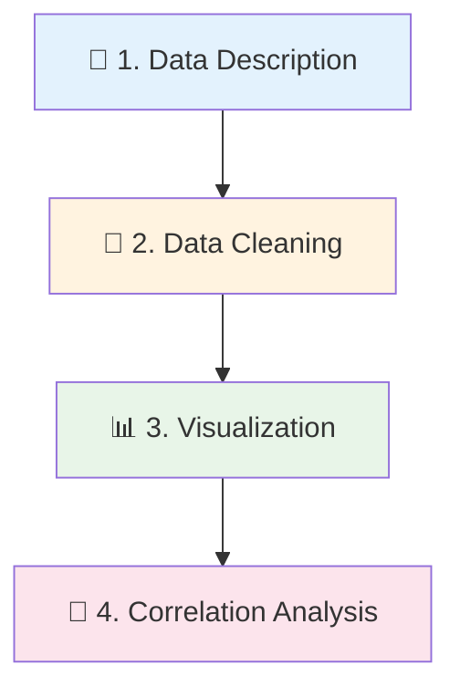

# 📊 Master Exploratory Data Analysis with Python

<div align="center">


**🎯 Complete EDA Tutorial • 📚 Beginner-Friendly • 🚀 Real-World Dataset**

*Learn data science fundamentals through hands-on SAT/ACT analysis*

<a href="https://medium.com/data-science/exploratory-data-analysis-tutorial-in-python-15602b417445" target="_blank">
  
</a>
<a href="https://github.com/cbratkovics/sat_act_analysis" target="_blank">
  
</a>

</div>

---

## 🎯 **What You'll Learn**

<div align="center">

### 🚀 **From Zero to EDA Hero in One Tutorial**

</div>

Transform raw data into actionable insights using **real SAT & ACT datasets** from 2017-2018. Perfect for aspiring data scientists, students, and professionals looking to master Python-based data analysis.

<table align="center">
<tr>
<th>🎓 **Skill Level**</th>
<th>⏱️ **Duration**</th>
<th>🛠️ **Tools**</th>
<th>📊 **Dataset**</th>
</tr>
<tr>
<td align="center">Beginner to Intermediate</td>
<td align="center">2-3 Hours</td>
<td align="center">Python, Pandas, Matplotlib</td>
<td align="center">Real SAT/ACT Data</td>
</tr>
</table>

---

## 🔍 **Why This Tutorial Matters**

<div align="center">

> **EDA is the foundation of every successful data science project**

</div>

### 📈 **Real-World Impact**

Standardized testing affects **millions of students** across the U.S. By analyzing SAT/ACT data, you'll uncover:

- 🏛️ **Policy Implications**: How state mandates affect participation
- 📊 **Performance Disparities**: Regional differences in test scores  
- 🎯 **Hidden Patterns**: Trends not visible in summary statistics
- 💡 **Data-Driven Insights**: Evidence-based conclusions about education

<div align="center">

### 🌟 **Key Learning Outcomes**

| 🧠 **Core Skills** | 📊 **Techniques** | 🎯 **Applications** |
|:---:|:---:|:---:|
| Data Cleaning | Statistical Analysis | Educational Research |
| Visualization | Correlation Analysis | Policy Impact Assessment |
| Pattern Recognition | Distribution Analysis | Comparative Studies |

</div>

---

## 🛠️ **4-Step EDA Mastery Framework**

<div align="center">



</div>

### 📄 **Step 1: Data Description & Exploration**

<div align="center">

| 🔍 **What We Check** | 🎯 **Why It Matters** |
|:---:|:---:|
| **Dataset Dimensions** | Understanding scope and scale |
| **Missing Values** | Data quality assessment |
| **Data Types** | Proper analysis preparation |
| **Sample Preview** | Initial pattern recognition |

</div>

**🔧 Key Techniques:**
- `df.info()` and `df.describe()` for quick insights
- Missing data visualization with heatmaps
- Data type validation and conversion

### 🧹 **Step 2: Data Cleaning & Preprocessing**

<div align="center">

| ⚠️ **Common Issues** | 🛠️ **Solutions** |
|:---:|:---:|
| **Missing Values** | Imputation strategies |
| **Wrong Data Types** | Type conversion |
| **Structural Errors** | Standardization |
| **Outliers** | Detection and handling |

</div>

**🎯 Pro Tips:**
- Use `pd.to_numeric()` for score conversions
- Handle percentage data consistently
- Validate state-level data integrity

### 📊 **Step 3: Visual Data Exploration**

<div align="center">

| 📈 **Chart Type** | 🎯 **Best For** | 🔍 **Insights** |
|:---:|:---:|:---:|
| **Bar Charts** | Comparing states | Participation patterns |
| **Histograms** | Score distributions | Performance spread |
| **Box Plots** | Outlier detection | Statistical summaries |
| **Scatter Plots** | Relationships | Correlation exploration |

</div>

**🎨 Visualization Highlights:**
- State-by-state participation comparisons
- Score distribution analysis
- Regional performance patterns

### 🔗 **Step 4: Correlation & Insights**

<div align="center">

| 🔥 **Analysis Type** | 📊 **Method** | 💡 **Key Finding** |
|:---:|:---:|:---:|
| **Participation vs Performance** | Correlation Matrix | Inverse relationship |
| **SAT vs ACT Preferences** | Heatmaps | Regional patterns |
| **State Policy Impact** | Comparative Analysis | Mandate effects |

</div>

---

## 📚 **Tutorial Structure**

<div align="center">

### 📖 **What's Inside**

</div>

<table align="center">
<tr>
<th>📂 **Section**</th>
<th>🎯 **Focus**</th>
<th>⏱️ **Time**</th>
<th>🏆 **Outcome**</th>
</tr>

<tr>
<td><strong>🚀 Setup & Imports</strong></td>
<td>Environment preparation</td>
<td>10 min</td>
<td>Ready-to-use workspace</td>
</tr>

<tr>
<td><strong>📊 Data Loading</strong></td>
<td>Dataset exploration</td>
<td>20 min</td>
<td>Understanding data structure</td>
</tr>

<tr>
<td><strong>🧹 Data Cleaning</strong></td>
<td>Quality assurance</td>
<td>30 min</td>
<td>Clean, analysis-ready data</td>
</tr>

<tr>
<td><strong>📈 Visualization</strong></td>
<td>Pattern discovery</td>
<td>45 min</td>
<td>Compelling visualizations</td>
</tr>

<tr>
<td><strong>🔍 Analysis</strong></td>
<td>Insight generation</td>
<td>30 min</td>
<td>Data-driven conclusions</td>
</tr>

<tr>
<td><strong>💡 Conclusions</strong></td>
<td>Key takeaways</td>
<td>15 min</td>
<td>Actionable insights</td>
</tr>

</table>

---

## 🚀 **Quick Start Guide**

### 📋 **Prerequisites**

```python
# Required libraries - install with pip
pip install pandas numpy matplotlib seaborn jupyter
```

### 🔧 **Setup Instructions**

```bash
# 1️⃣ Clone the repository
git clone https://github.com/cbratkovics/sat_act_analysis.git
cd sat_act_analysis

# 2️⃣ Launch Jupyter Notebook
jupyter notebook

# 3️⃣ Open the main tutorial file
# Click on "EDA_Tutorial.ipynb"
```

### 📦 **Essential Imports**

```python
# Data manipulation powerhouse
import pandas as pd
import numpy as np

# Visualization magic
import matplotlib.pyplot as plt
import seaborn as sns

# Make plots look professional
plt.style.use('seaborn-v0_8')
sns.set_palette("husl")
```

---

## 📊 **Sample Insights You'll Discover**

<div align="center">

### 🔍 **Key Findings Preview**

</div>

> **💡 Surprising Discovery**: States with **higher SAT participation** often show **lower average scores** - revealing the importance of considering mandatory vs. voluntary testing!

<div align="center">

| 🏆 **Top Insights** | 📈 **Impact** |
|:---:|:---:|
| **Participation-Performance Paradox** | 🎯 Challenges conventional wisdom |
| **Regional Testing Preferences** | 🗺️ Geographic policy patterns |
| **Score Distribution Patterns** | 📊 Statistical learning |
| **State Mandate Effects** | 🏛️ Policy impact analysis |

</div>

---

## 🎯 **Perfect For**

<div align="center">

| 👩‍🎓 **Students** | 👨‍💼 **Professionals** | 🔬 **Researchers** |
|:---:|:---:|:---:|
| Learning Python basics | Transitioning to data roles | Education policy analysis |
| Building portfolio projects | Upskilling in analytics | Academic research |
| Understanding EDA workflow | Data-driven decision making | Statistical methodology |

</div>

---

## 🌟 **Why This Tutorial Stands Out**

<div align="center">

### ✨ **Unique Features**

</div>

<table align="center">
<tr>
<th>🎯 **Feature**</th>
<th>💡 **Benefit**</th>
<th>🚀 **Result**</th>
</tr>

<tr>
<td><strong>🔍 Real Dataset</strong></td>
<td>Authentic learning experience</td>
<td>Job-ready skills</td>
</tr>

<tr>
<td><strong>📚 Step-by-Step</strong></td>
<td>No prerequisites assumed</td>
<td>Confident progression</td>
</tr>

<tr>
<td><strong>🎨 Beautiful Visuals</strong></td>
<td>Professional-quality outputs</td>
<td>Portfolio-worthy results</td>
</tr>

<tr>
<td><strong>💭 Critical Thinking</strong></td>
<td>Not just how, but why</td>
<td>Deeper understanding</td>
</tr>

</table>

---

## 📈 **Learning Path**

<div align="center">

### 🎯 **From Beginner to EDA Expert**

</div>

```
📚 Complete This Tutorial
    ↓
🔍 Practice with Other Datasets
    ↓
📊 Build Your Own EDA Projects
    ↓
🚀 Apply to Real-World Problems
    ↓
🏆 Become a Data Science Professional
```

---

## 🤝 **Community & Support**

<div align="center">

**Join the Data Science Learning Community!**

</div>

- 💬 **Questions?** Open an issue on GitHub
- 🔄 **Improvements?** Submit a pull request  
- 📢 **Share your results** on social media with `#EDAMastery`
- ⭐ **Found it helpful?** Star the repository!

---

## 📚 **Additional Resources**

<div align="center">

### 🎓 **Continue Your Learning Journey**

</div>

| 📖 **Resource** | 🎯 **Focus** | 🔗 **Link** |
|:---:|:---:|:---:|
| **Medium Article** | In-depth explanation | [Read Tutorial](https://medium.com/data-science/exploratory-data-analysis-tutorial-in-python-15602b417445) |
| **GitHub Repository** | Complete code & data | [View Code](https://github.com/cbratkovics/sat_act_analysis) |
| **Jupyter Notebook** | Interactive experience | Available in repo |

---

<div align="center">

**🎯 Ready to Master EDA? Let's Start Your Data Science Journey! 🚀**

[](https://github.com/cbratkovics/sat_act_analysis)
[](https://github.com/cbratkovics/sat_act_analysis)

**Share your success story** | **Tag us in your projects** | **Help others learn!**

</div>
